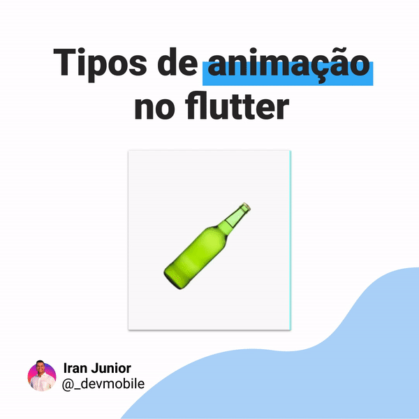

# Diferentes tipos de animação que podem ser usada no seu app flutter

Esse projeto tem todo o código usado no [post]() do instagram.

## Descrição

No post do instagram é mostrado os tipos de animações que podem compor o seu app flutter. No post eu lhe apresento [animações implícitas](https://flutter.dev/docs/development/ui/animations/implicit-animations), [controller de animação](https://flutter.dev/docs/development/ui/animations/tutorial#animationcontroller), [tween animations](https://flutter.dev/docs/development/ui/animations/tutorial#tween), [cosntruturoes de animação](https://api.flutter.dev/flutter/widgets/AnimatedBuilder-class.html), e outras. Lá eu explico como funciona essas animações na prática e te mostro como usar cada uma delas. 

## Sobre este repositório

Neste repositório você pode encontrar todas os códigos usados no post. Pode baixar o repositório e rodar no seu computador, para ver na prática as animações em funcionamento.

## Redes sociais

  

  

  

  